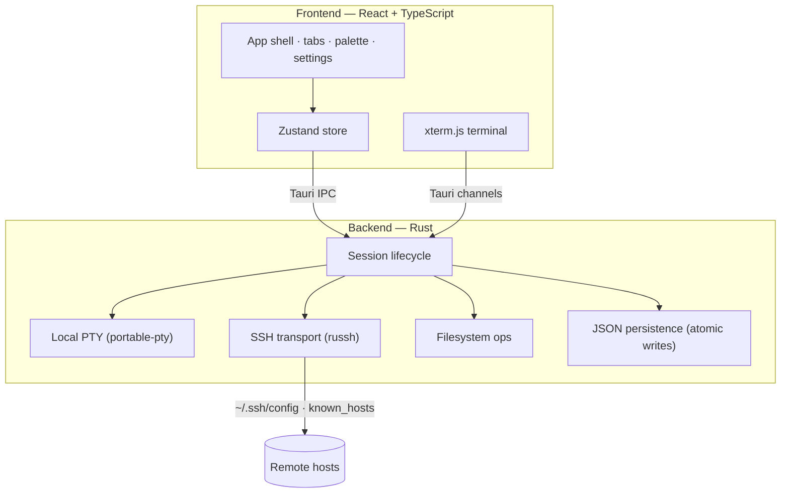

	

<h1 align="center">Termif</h1>

	<b>Local-first cross-platform SSH workspace</b> 
	Native shells, remote hosts, contextual files, snippets, and integrated editing — in one frame.

	
	
	

	
	
	
	
	

Language: 🇬🇧 [English](README.md) | 🇷🇺 [Русский](README.ru.md) &nbsp;•&nbsp; Docs: 🇬🇧 [Documentation](docs/README.md) | 🇷🇺 [Документация](docs/README.ru.md)

## ⬇ Download

Grab the latest installer for your platform. Builds are published by [GitHub Actions](.github/workflows/ci-release.yml) with SHA-256 `checksums-*.txt` files — verify before installing.

<table>
	<tr>
		<th>Platform</th>
		<th>Download</th>
		<th>Notes</th>
	</tr>
	<tr>
		<td>🍎 <b>macOS</b> (Apple Silicon)</td>
		<td></td>
		<td>M1/M2/M3 and newer</td>
	</tr>
	<tr>
		<td>🍎 <b>macOS</b> (Intel)</td>
		<td></td>
		<td>Intel Macs</td>
	</tr>
	<tr>
		<td>🪟 <b>Windows</b> (x64)</td>
		<td></td>
		<td>or <a href="https://github.com/KOSFin/Termif/releases/latest/download/Termif-Windows-x64-setup.exe">NSIS .exe</a></td>
	</tr>
	<tr>
		<td>🐧 <b>Linux</b> (x64)</td>
		<td></td>
		<td>or <a href="https://github.com/KOSFin/Termif/releases/latest/download/Termif-Linux-x64.deb">.deb</a></td>
	</tr>
</table>

Looking for a specific build, checksums, or older versions? See <a href="https://github.com/KOSFin/Termif/releases">all GitHub Releases</a> or the <a href="https://kosfin.github.io/Termif/">download site</a> (auto-detects your OS).

## Demo

	

👉 The GIF is a quick taste — see the <a href="#-gallery">full gallery</a> for the editor, SSH picker, and themes in full resolution.

## What Termif Is

Termif is a local-first desktop SSH workspace for operators and developers who move constantly between local and remote environments. The application combines low-latency local PTY sessions, SSH session orchestration, contextual file navigation, snippets, and editing in one frame. Instead of treating terminal, files, and editor as disconnected utilities, Termif keeps those surfaces synchronized around the active tab context and connection state.

The product now targets Windows, macOS, and Linux from the same codebase. Platform differences are isolated to shell/profile resolution, keyboard conventions, window controls, filesystem roots, and release packaging, while terminal, SSH, editor, and workspace behavior remain shared.

## Why Termif

Termif is built for daily SSH-heavy work where the useful context should stay on your machine. Hosts, settings, snippets, and restored UI state are local by default. Remote connections are explicit, host-key trust is visible, and detached SSH tabs reconnect only when you ask them to.

It is not positioned as just another terminal skin. Termif is a focused workspace for moving between a shell, remote files, quick commands, and release checks without scattering that work across separate apps.

## Typical Workflow

1. Start from a local shell tab.
2. Open an SSH picker tab or import hosts from `~/.ssh/config`.
3. Connect to a host, browse the active local or remote path, and preview or edit files.
4. Run saved snippets into the active terminal.
5. Reconnect detached SSH tabs explicitly after restart or network failure.

## Who It Is For

Termif fits developers, solo operators, homelab owners, and small infrastructure teams who want a native desktop workspace for many machines. It is especially useful when you want local settings and files, predictable cross-platform shortcuts, and release artifacts you can verify before installing.

## Verify Downloads

Download installers only from the [Termif site](https://kosfin.github.io/Termif/) or [GitHub Releases](https://github.com/KOSFin/Termif/releases). Release assets include `checksums-*.txt` files when CI publishes bundles. Compare the SHA-256 hash of the downloaded installer with the matching checksum before installing.

Stable updater manifests are signed separately through Tauri updater signing secrets. Windows/macOS code signing and notarization are still hardening roadmap items, not completed guarantees.

## Product Capabilities

Termif ships a custom app shell with premium tab behaviors, including rename, color tagging, duplication, fast close, and keyboard-driven switching with MRU or positional mode. The top-level command palette orchestrates workspace actions without forcing users through deep menu trees. A native-feeling title bar, custom window controls, and layout docking keep interaction density high without losing clarity.

Local sessions run through portable PTY integration and stream output to xterm.js in real time. SSH sessions are provisioned through a host picker that merges imported ~/.ssh/config hosts and managed hosts, supports grouping, allows alias overrides, and can persist quick-connect definitions. When remote sessions degrade, the UI surfaces explicit disconnect reasons and uses reconnect flows instead of silent failure.

The sidebar is contextual. For local tabs, it operates on local filesystem paths. For SSH tabs, it resolves the remote path via the active session and performs remote listing, read, and write operations. The editor layer supports preview and edit modes, tracks dirty state, opens in docked mode or separate windows, and keeps remote versus local provenance visible per file tab.

Snippets provide lightweight command storage in the sidebar with collapsible text sections and one-click execution into the active terminal. They are intentionally local to the client environment.

The status bar supplies SSH runtime telemetry with CPU, RAM, disk, user counts, and server clock snapshots, while local clock and visibility controls remain configurable from settings.

## Runtime Architecture

Termif is built as a Tauri v2 desktop shell with a React + TypeScript frontend and a Rust backend.

The frontend handles interaction surfaces, state projection, and keyboard orchestration. A centralized Zustand store coordinates tabs, host state, file context, editor workspace, and UI overlays. xterm.js handles rendering, and terminal output is delivered through Tauri channels rather than polling.

The backend owns session lifecycle, SSH transport, filesystem operations, settings, host persistence, and monitoring loops. Local shell sessions are spawned through portable-pty. SSH execution, shell channels, and remote command capture run through russh. Persistence is file-based JSON in the Tauri app data directory with atomic temp-file replacement for writes.

For architectural deep dive, read [ARCHITECTURE.md](ARCHITECTURE.md).

## Persistence and Data Behavior

Termif persists operational state in JSON artifacts that are explicitly scoped by concern: settings.json for runtime preferences, hosts.json for managed hosts/groups/import overrides, and ui_state.json for tab presentation metadata and active tab restoration. Snippets and bounded per-tab terminal logs are currently persisted in frontend localStorage and bound to the client environment.

On startup, Termif attempts to recover saved tab metadata and reconstruct local or SSH-picker tabs. Local shells start as fresh processes while their previous visible scrollback can be replayed from the saved tab log. SSH tabs restore as detached tabs that can reconnect explicitly. If restoration is missing or invalid, the product falls back to creating a default local tab to preserve a bootable workspace.

Detailed model and compatibility rules are documented in [docs/persistence-model.md](docs/persistence-model.md) and [docs/settings-model.md](docs/settings-model.md).

## Platform Support

Release packaging targets Windows MSI/NSIS installers, macOS DMG/App bundles, and Linux DEB/AppImage packages. GitHub Actions validates and builds on Windows, macOS, and Ubuntu, then publishes platform artifacts with SHA-256 checksum files.

Local shell defaults follow the host platform: PowerShell on Windows, zsh on macOS, and bash on Linux. App shortcuts use Ctrl on Windows/Linux and Command on macOS, while terminal control sequences such as Ctrl+C remain available to the running shell. SSH host import/export resolves the user's platform home directory and uses the standard `~/.ssh/config` location on every OS.

| Platform | Architectures | Installers | Default shell |
| -------- | ------------- | ---------- | ------------- |
| 🍎 macOS | Apple Silicon (arm64), Intel (x64) | DMG, App | zsh |
| 🪟 Windows | x64 | MSI, NSIS (.exe) | PowerShell |
| 🐧 Linux | x64 | AppImage, DEB | bash |

## Failure Semantics and Error Surfacing

Termif surfaces concrete failures rather than generic UI states. If a session id is stale, backend calls return session not found. If SSH authentication fails, the UI receives an explicit password/key rejected message. Remote list/read/write commands propagate stderr payloads when available. Unsupported operations, such as invoking remote-only behavior on local sessions, return deterministic unsupported operation errors. Missing ~/.ssh/config files are handled as an empty import set instead of a fatal condition.

## Documentation Map

[ARCHITECTURE.md](ARCHITECTURE.md) describes runtime boundaries and execution paths.

[ROADMAP.md](ROADMAP.md) tracks product direction and delivery themes.

[CONTRIBUTING.md](CONTRIBUTING.md) defines repository standards and review contract.

[docs/settings-model.md](docs/settings-model.md), [docs/persistence-model.md](docs/persistence-model.md), [docs/plugin-system-proposal.md](docs/plugin-system-proposal.md), and [docs/ci-release-plan.md](docs/ci-release-plan.md) cover subsystem specifications.

## Contributing & Community

Contributions are welcome. Start with [CONTRIBUTING.md](CONTRIBUTING.md), and please follow the [Code of Conduct](CODE_OF_CONDUCT.md). Use the issue templates to file [bugs](.github/ISSUE_TEMPLATE/bug_report.yml) or [feature requests](.github/ISSUE_TEMPLATE/feature_request.yml).

Found a security issue? Report it privately via a [GitHub Security Advisory](https://github.com/KOSFin/Termif/security/advisories/new) — see [SECURITY.md](SECURITY.md). Never open a public issue for vulnerabilities.

## 🖼 Gallery

<table>
	<tr>
		<td width="50%"><b>SSH host picker</b> </td>
		<td width="50%"><b>Integrated editor</b> </td>
	</tr>
	<tr>
		<td width="50%"><b>Workspace with background image</b> </td>
		<td width="50%"><b>Workspace</b> </td>
	</tr>
	<tr>
		<td width="50%"><b>Focused (sidebar hidden)</b> </td>
		<td width="50%"><b>Windows</b> </td>
	</tr>
</table>

## Architecture at a Glance

See [ARCHITECTURE.md](ARCHITECTURE.md) for the full runtime breakdown.

## License and Commercial Use

Termif uses a source-available attribution license. You may use, copy, modify, and share the source with visible credit to the original Termif project. Commercial distribution, paid hosting, resale, or embedding in a commercial product requires prior written permission from the Termif maintainers.

This is intentionally not an OSI open-source license such as MIT or Apache-2.0, because those licenses allow commercial use without additional permission.

Full legal text: [LICENSE](LICENSE).

## Star History

If Termif is useful to you, a ⭐ helps others find it.

