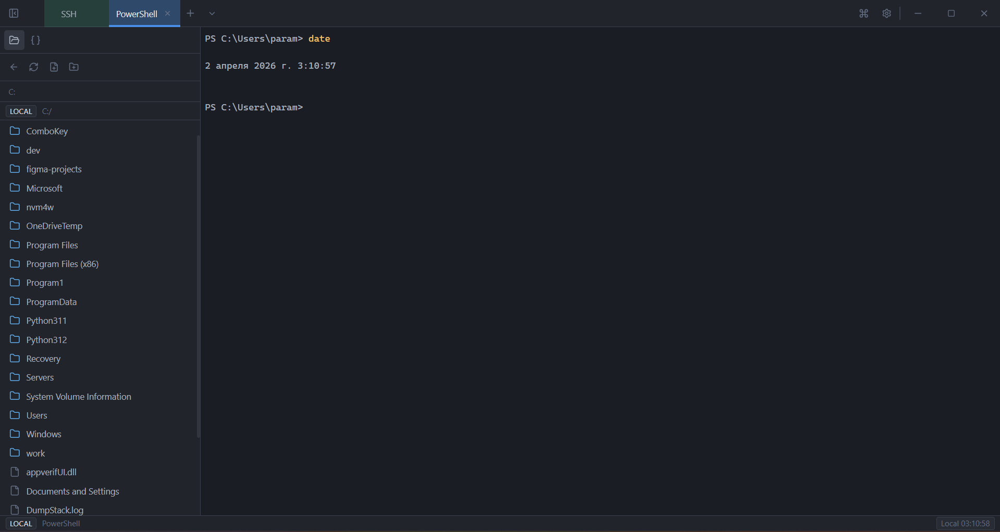
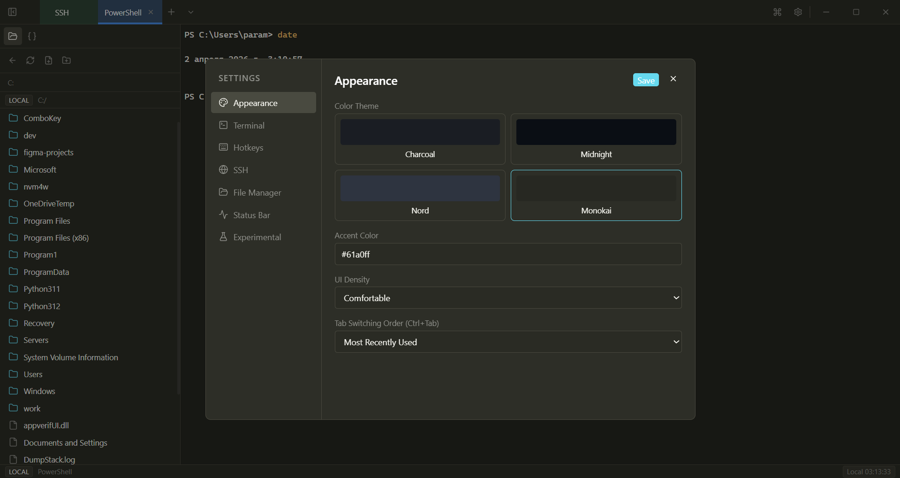

  

<h1 align="center">Termif</h1>

  Терминальный рабочий стол для Windows: локальные shell-сессии, SSH-оркестрация, контекстный файловый менеджер и встроенное редактирование.

  
  
  
  
  
  

Язык документации по умолчанию: English.

Навигация по языкам: 🇬🇧 [English](README.md) | 🇷🇺 [Русский](README.ru.md)

Хабы документации: 🇬🇧 [Documentation](docs/README.md) | 🇷🇺 [Документация](docs/README.ru.md)

## Что Такое Termif

Termif - это продуктовый терминальный workspace для инженеров и операторов, которые постоянно переключаются между локальными и удаленными окружениями. Приложение объединяет локальные PTY-сессии, SSH-подключения, файловую навигацию и редактор в едином контексте активной вкладки. Это не набор несвязанных утилит, а единая рабочая среда, где терминал, файлы и редактор синхронизированы между собой.

Текущая продуктовая линия ориентирована на Windows. Архитектура модулей при этом подготовлена для последующего расширения на другие платформы.

## Что Уже Работает

Интерфейс включает кастомную оболочку окна, расширенные вкладки (переименование, цвета, дублирование, закрытие), командную палитру, настройки и горячие клавиши. Локальные сессии запускаются через portable-pty, SSH-сессии управляются через host picker с импортом из ~/.ssh/config, поддержкой managed hosts, групп и quick connect.

Файловый менеджер контекстный: в локальных вкладках работает с локальной ФС, в SSH-вкладках - с удаленной. Редактор поддерживает preview/edit режимы, dirty-state, докинг, popout-окна и сохранение как локальных, так и удаленных файлов.

В статус-баре для SSH отображаются метрики CPU/RAM/Disk, количество пользователей и серверное время.

## Архитектура И Данные

Фронтенд построен на React + TypeScript + Zustand, backend - на Rust внутри Tauri v2. Поток терминала идет через Tauri Channel, а не через постоянный polling. Основные persist-артефакты: settings.json, hosts.json и ui_state.json в app data директории. Сниппеты сейчас сохраняются в localStorage клиента.

Детали:

- [ARCHITECTURE.md](ARCHITECTURE.md)
- [docs/settings-model.md](docs/settings-model.md)
- [docs/persistence-model.md](docs/persistence-model.md)

## Поддерживаемые Платформы

Сейчас официально поддерживается Windows с упаковкой в MSI и NSIS. CI и артефакты выпуска ориентированы на Windows. Linux и macOS пока не объявлены как поддерживаемые release-платформы.

## Скриншоты

## Ошибки И Восстановление

Termif отдает конкретные ошибки вместо абстрактных сообщений. Если сессия не найдена, backend возвращает session not found. Ошибки SSH-аутентификации и удаленных операций чтения/записи/листинга пробрасываются в UI с исходным текстом stderr, когда это возможно. При потере соединения вкладка переводится в disconnect-state с возможностью reconnect.

## Лицензия И Форки

Проект распространяется под лицензией Termif Attribution License 1.0. Форкать, модифицировать и распространять можно, включая коммерческие сценарии, при обязательном сохранении атрибуции и заметного упоминания оригинального проекта Termif.

Полный текст: [LICENSE](LICENSE).
