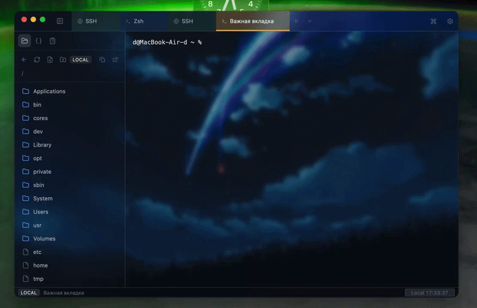
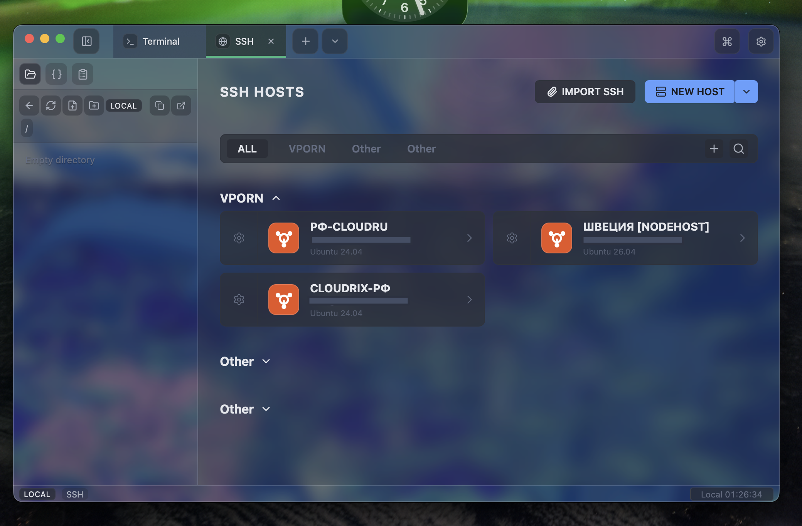
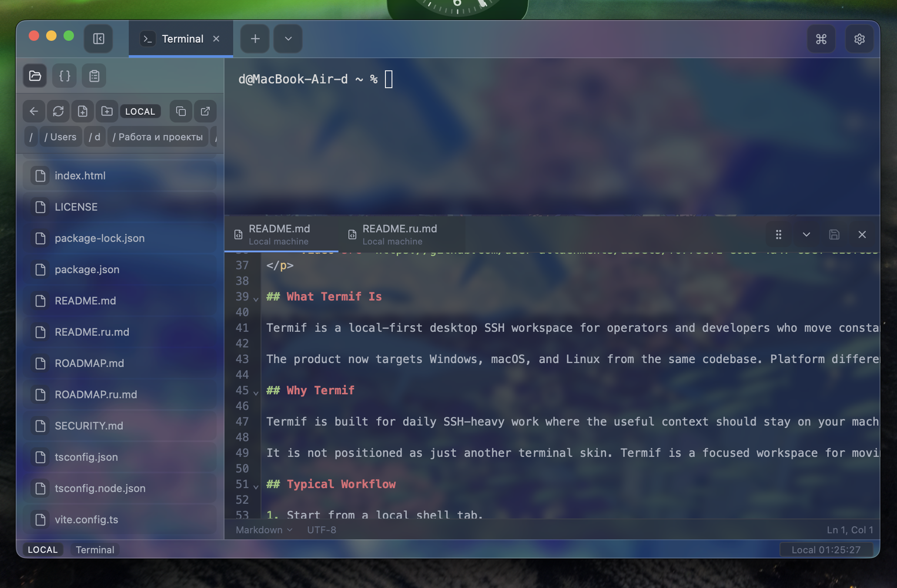
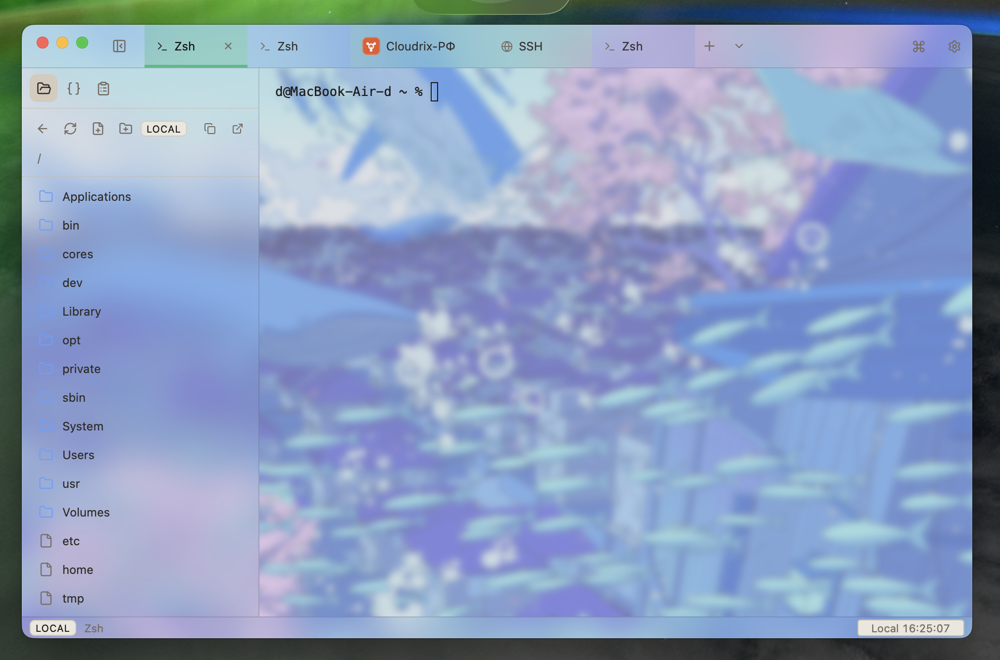
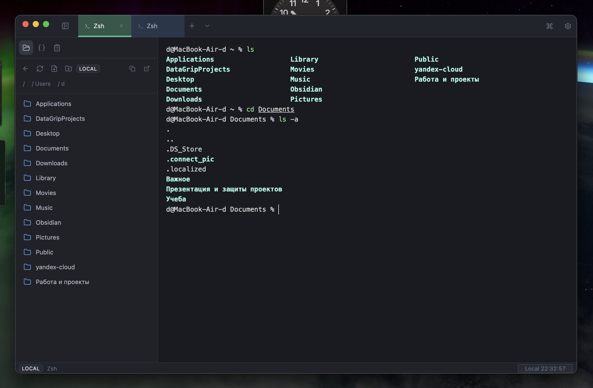
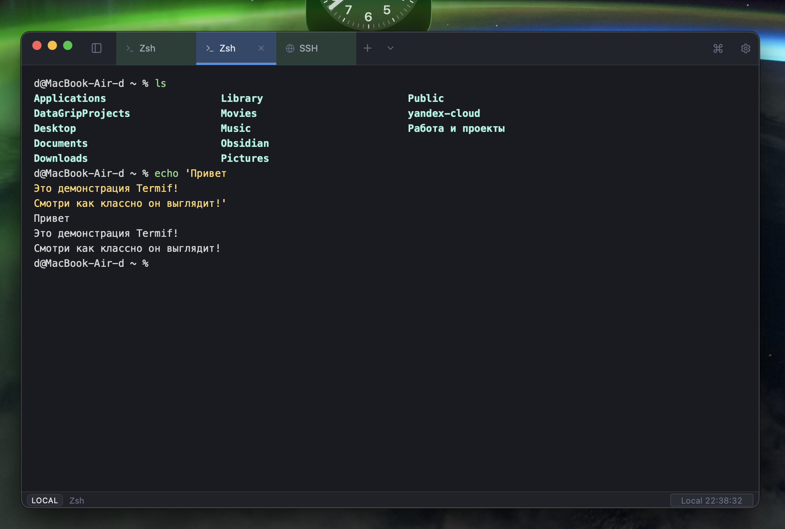
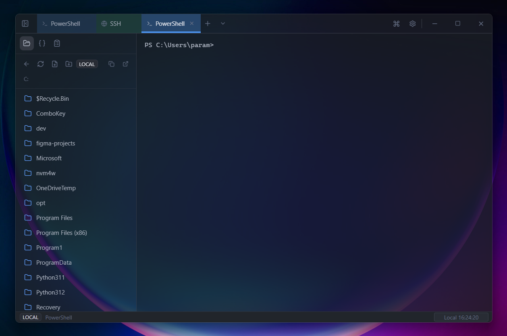
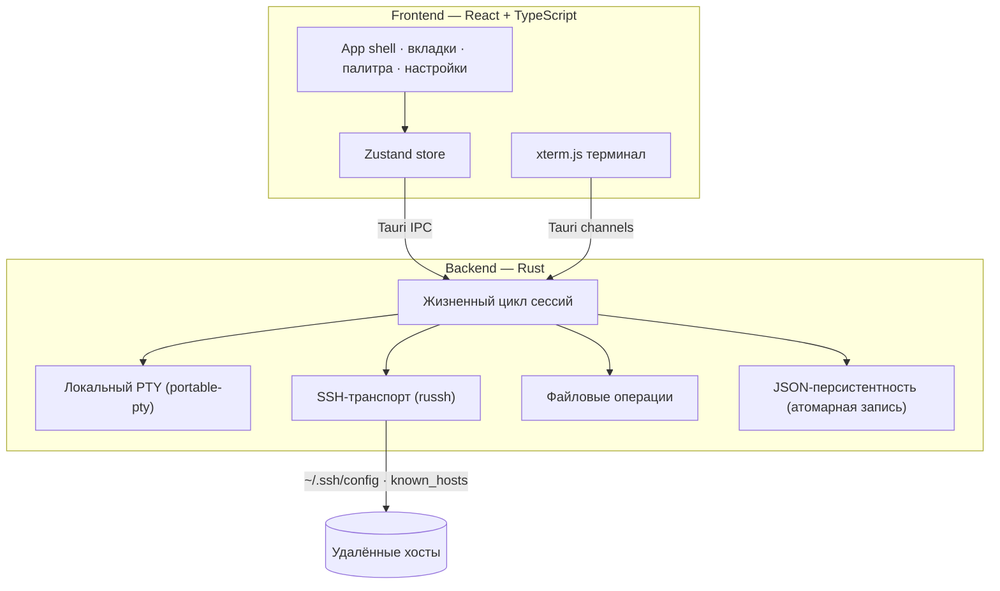

  

<h1 align="center">Termif</h1>

  <b>Local-first кроссплатформенный SSH workspace</b> 
  Локальные shell-сессии, удалённые хосты, контекстные файлы, сниппеты и встроенный редактор — в одном окне.

  
  
  

  
  
  
  
  

Язык: 🇬🇧 [English](README.md) | 🇷🇺 [Русский](README.ru.md) &nbsp;•&nbsp; Документация: 🇬🇧 [Documentation](docs/README.md) | 🇷🇺 [Документация](docs/README.ru.md)

## ⬇ Загрузка

Скачайте установщик для вашей платформы. Сборки публикуются через [GitHub Actions](.github/workflows/ci-release.yml) вместе с файлами SHA-256 `checksums-*.txt` — проверяйте перед установкой.

<table>
  <tr>
    <th>Платформа</th>
    <th>Загрузка</th>
    <th>Примечание</th>
  </tr>
  <tr>
    <td>🍎 <b>macOS</b> (Apple Silicon)</td>
    <td></td>
    <td>M1/M2/M3 и новее</td>
  </tr>
  <tr>
    <td>🍎 <b>macOS</b> (Intel)</td>
    <td></td>
    <td>Intel Mac</td>
  </tr>
  <tr>
    <td>🪟 <b>Windows</b> (x64)</td>
    <td></td>
    <td>или <a href="https://github.com/KOSFin/Termif/releases/latest/download/Termif-Windows-x64-setup.exe">NSIS .exe</a></td>
  </tr>
  <tr>
    <td>🐧 <b>Linux</b> (x64)</td>
    <td></td>
    <td>или <a href="https://github.com/KOSFin/Termif/releases/latest/download/Termif-Linux-x64.deb">.deb</a></td>
  </tr>
</table>

Нужна конкретная сборка, checksums или старые версии? Смотрите <a href="https://github.com/KOSFin/Termif/releases">все релизы</a> или <a href="https://kosfin.github.io/Termif/">сайт загрузки</a> (определяет вашу ОС автоматически).

## Демо

  

👉 GIF — это краткое превью. Полное разрешение редактора, SSH-пикера и тем — в <a href="#-галерея">галерее</a>.

## Что Такое Termif

Termif - это local-first desktop SSH workspace для инженеров и операторов, которые постоянно переключаются между локальными и удаленными окружениями. Приложение объединяет локальные PTY-сессии, SSH-подключения, файловую навигацию, сниппеты и редактор в едином контексте активной вкладки. Это не набор несвязанных утилит, а рабочая среда, где терминал, файлы и редактор синхронизированы между собой.

Текущая продуктовая линия ориентирована на Windows, macOS и Linux из одной кодовой базы. Платформенные различия вынесены в отдельные места: shell-профили, горячие клавиши, root-пути локальной файловой системы, элементы управления окном и упаковка релизов.

## Why Termif

Termif сделан для ежедневной SSH-нагруженной работы, где полезный контекст должен оставаться на вашей машине. Hosts, settings, snippets и восстановление UI хранятся локально по умолчанию. Удаленные подключения выполняются явно, host-key trust виден пользователю, а detached SSH-вкладки переподключаются только по явному действию.

Это не “еще один терминал с темой”. Termif - сфокусированный workspace для перехода между shell, удаленными файлами, быстрыми командами и release checks без рассыпания работы по разным приложениям.

## Типичный Workflow

1. Откройте локальную shell-вкладку.
2. Перейдите в SSH picker или импортируйте хосты из `~/.ssh/config`.
3. Подключитесь к хосту, откройте локальный или удаленный путь активной вкладки, preview/edit файл.
4. Запустите сохраненный snippet в активный терминал.
5. После рестарта или обрыва сети переподключите detached SSH-вкладку явно.

## Для Кого

Termif подходит разработчикам, solo operators, homelab-владельцам и небольшим infra-командам, которым нужен нативный desktop workspace для многих машин. Особенно хорошо он ложится на сценарии, где важны локальные настройки, предсказуемые хоткеи, контекстный файловый менеджер и проверяемые release artifacts.

## Проверка Загрузок

Скачивайте установщики только с [сайта Termif](https://kosfin.github.io/Termif/) или из [GitHub Releases](https://github.com/KOSFin/Termif/releases). В релизах публикуются `checksums-*.txt`, когда CI готовит bundles. Перед установкой сверяйте SHA-256 скачанного файла с соответствующим checksum.

Stable updater manifests подписываются отдельно через Tauri updater signing secrets. Windows/macOS code signing и notarization пока остаются задачами hardening roadmap, а не готовой гарантией.

## Что Уже Работает

Интерфейс включает кастомную оболочку окна, расширенные вкладки (переименование, цвета, дублирование, закрытие), командную палитру, настройки и горячие клавиши. Локальные сессии запускаются через portable-pty, SSH-сессии управляются через host picker с импортом из ~/.ssh/config, поддержкой managed hosts, групп и quick connect.

Файловый менеджер контекстный: в локальных вкладках работает с локальной ФС, в SSH-вкладках - с удаленной. Редактор поддерживает preview/edit режимы, dirty-state, докинг, popout-окна и сохранение как локальных, так и удаленных файлов.

Сниппеты хранят часто используемые команды в боковой панели: группы раскрываются как компактные текстовые списки, а команда отправляется в активный терминал одним действием.

В статус-баре для SSH отображаются метрики CPU/RAM/Disk, количество пользователей и серверное время.

## Архитектура И Данные

Фронтенд построен на React + TypeScript + Zustand, backend - на Rust внутри Tauri v2. Поток терминала идет через Tauri Channel, а не через постоянный polling. Основные persist-артефакты: settings.json, hosts.json и ui_state.json в app data директории. Сниппеты и ограниченные по размеру журналы терминала для вкладок сейчас сохраняются в localStorage клиента.

При старте Termif восстанавливает метаданные вкладок. Локальные shell-вкладки запускаются как новые процессы, но прежний видимый scrollback может быть показан из сохраненного журнала вкладки. SSH-вкладки восстанавливаются как detached-состояние с явным reconnect.

Детали:

- [ARCHITECTURE.md](ARCHITECTURE.md)
- [docs/settings-model.md](docs/settings-model.md)
- [docs/persistence-model.md](docs/persistence-model.md)

## Поддерживаемые Платформы

Релизная сборка готовит Windows MSI/NSIS, macOS DMG/App и Linux DEB/AppImage. GitHub Actions прогоняет проверки и сборку на Windows, macOS и Ubuntu, после чего публикует артефакты и SHA-256 checksums в GitHub Release.

Локальный shell выбирается по платформе: PowerShell на Windows, zsh на macOS и bash на Linux. Команды приложения используют Ctrl на Windows/Linux и Command на macOS, при этом терминальные последовательности вроде Ctrl+C остаются доступными shell-сессии. Импорт и экспорт SSH-хостов работают через стандартный `~/.ssh/config` в home-директории текущей платформы.

| Платформа | Архитектуры | Установщики | Shell по умолчанию |
| --------- | ----------- | ----------- | ------------------ |
| 🍎 macOS | Apple Silicon (arm64), Intel (x64) | DMG, App | zsh |
| 🪟 Windows | x64 | MSI, NSIS (.exe) | PowerShell |
| 🐧 Linux | x64 | AppImage, DEB | bash |

## Ошибки И Восстановление

Termif отдает конкретные ошибки вместо абстрактных сообщений. Если сессия не найдена, backend возвращает session not found. Ошибки SSH-аутентификации и удаленных операций чтения/записи/листинга пробрасываются в UI с исходным текстом stderr, когда это возможно. При потере соединения вкладка переводится в disconnect-state с возможностью reconnect.

## Участие И Сообщество

Контрибьюции приветствуются. Начните с [CONTRIBUTING.ru.md](CONTRIBUTING.ru.md) и соблюдайте [Code of Conduct](CODE_OF_CONDUCT.md). Используйте шаблоны для [багов](.github/ISSUE_TEMPLATE/bug_report.yml) и [предложений](.github/ISSUE_TEMPLATE/feature_request.yml).

Нашли уязвимость? Сообщите приватно через [GitHub Security Advisory](https://github.com/KOSFin/Termif/security/advisories/new) — см. [SECURITY.md](SECURITY.md). Не открывайте публичные issue для уязвимостей.

## 🖼 Галерея

<table>
  <tr>
    <td width="50%"><b>SSH-пикер хостов</b> </td>
    <td width="50%"><b>Встроенный редактор</b> </td>
  </tr>
  <tr>
    <td width="50%"><b>Рабочая область с фоновым изображением</b> </td>
    <td width="50%"><b>Рабочая область</b> </td>
  </tr>
  <tr>
    <td width="50%"><b>Фокус (без сайдбара)</b> </td>
    <td width="50%"><b>Windows</b> </td>
  </tr>
</table>

## Архитектура Вкратце

Полное описание рантайма — в [ARCHITECTURE.md](ARCHITECTURE.md).

## Лицензия И Коммерческое Использование

Проект распространяется по лицензии MIT. Исходный код можно свободно использовать, модифицировать, распространять, сублицензировать и применять в коммерческих продуктах при сохранении текста лицензии.

MIT — это OSI-совместимая open-source лицензия, которая разрешает коммерческое использование без дополнительного согласования.

Полный текст: [LICENSE](LICENSE).

## История Звёзд

Если Termif вам полезен — ⭐ помогает другим его найти.

